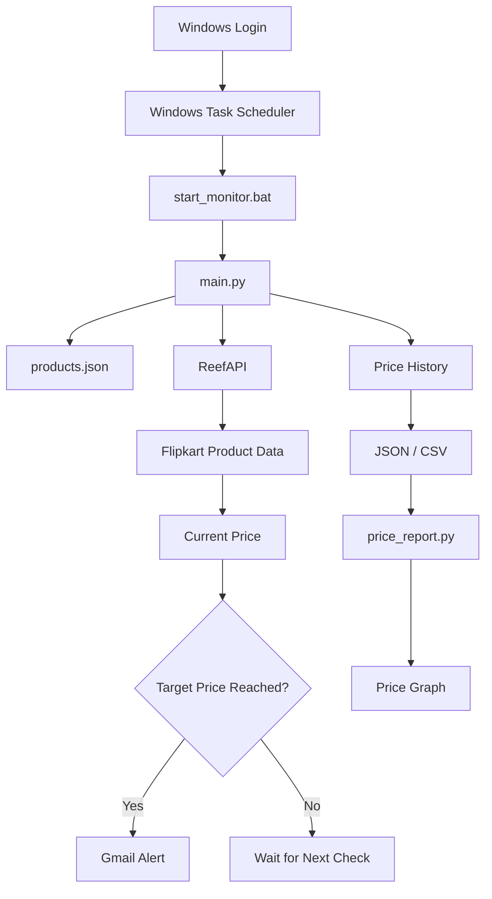
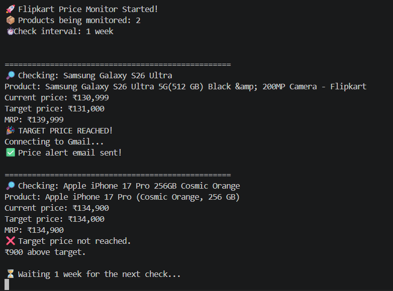

# 🚀 Flipkart Price Monitoring System

A Python-based price monitoring system that checks Flipkart product
prices through the ReefAPI service, compares them with user-defined
target prices, sends Gmail alerts when a target is reached, stores price
history, and generates CSV reports and price-history graphs.

## 📌 Project Overview

For each configured product, the system: 1. Gets product data through
ReefAPI. 2. Reads the current price and MRP. 3. Compares the current
price with the target price. 4. Sends a Gmail alert when the target is
reached. 5. Prevents repeated alerts while the price remains at or below
the target. 6. Stores price-history information. 7. Generates CSV
reports and graphs. 8. Handles common API, network, and email errors. 9.
Can be started automatically through Windows Task Scheduler.

> **Note:** The project uses an API service rather than directly
> scraping Flipkart pages.

## 🏗️ Project Architecture



## 📂 Project Structure

``` text
price monitoring crawler/
│
├── main.py
├── products.json
├── start_monitor.bat
├── price_report.py
├── demo_history.py
├── demo_price_history.json
├── demo_price_history.csv
├── price_history.json
├── price_history.csv
├── requirements.txt
├── README.md
└── generated price graph files
```

  File                   Purpose
  ---------------------- ------------------------------------------------
  `main.py`              Main price monitoring program
  `products.json`        Product URLs, target prices and email settings
  `start_monitor.bat`    Starts the Python monitor
  `price_report.py`      Generates price reports and graphs
  `demo_history.py`      Creates sample historical data
  `price_history.json`   Stored price-history data
  `price_history.csv`    CSV version of price history
  `requirements.txt`     Python dependencies

## ⚙️ Technologies Used

-   **Python**
-   **Requests** --- API requests
-   **JSON** --- configuration and history storage
-   **Pandas** --- report/data processing
-   **Matplotlib** --- price graphs
-   **smtplib** --- Gmail email alerts
-   **ReefAPI** --- Flipkart product-price data
-   **Windows Task Scheduler** --- automatic startup
-   **Git/GitHub** --- version control

## 📦 Installation

``` bash
pip install -r requirements.txt
```

If Pandas and Matplotlib are not included in `requirements.txt`:

``` bash
pip install pandas matplotlib
```

## 🔐 Environment Variables

Sensitive credentials should be stored as environment variables.

PowerShell:

``` powershell
$env:REEF_KEY="YOUR_REEF_API_KEY"
$env:PRICE_MONITOR_EMAIL_PASSWORD="YOUR_GMAIL_APP_PASSWORD"
```

For persistent Windows user variables:

``` powershell
[Environment]::SetEnvironmentVariable("REEF_KEY", "YOUR_REEF_API_KEY", "User")
```

``` powershell
[Environment]::SetEnvironmentVariable("PRICE_MONITOR_EMAIL_PASSWORD", "YOUR_GMAIL_APP_PASSWORD", "User")
```

Never commit API keys or Gmail App Passwords to GitHub.

## 📝 Product Configuration

Example `products.json`:

``` json
[
    {
        "name": "Samsung Galaxy S26 Ultra",
        "url": "YOUR_FLIPKART_PRODUCT_URL",
        "target_price": 131000,
        "email": "your-email@example.com"
    },
    {
        "name": "Apple iPhone 17 Pro 256GB Cosmic Orange",
        "url": "YOUR_FLIPKART_PRODUCT_URL",
        "target_price": 134000,
        "email": "your-email@example.com"
    }
]
```

Replace example values with your own.

## ▶️ Run the Monitor

``` powershell
python main.py
```

Expected startup:

``` text
🚀 Flipkart Price Monitor Started!
📦 Products being monitored: 2
⏱️ Check interval: 1 week
```

## ⏱️ Monitoring Interval

The current monitor checks once per week:

``` python
CHECK_INTERVAL = 7 * 24 * 60 * 60
```

This equals 7 days.

## 📧 Price Alert Logic

The alert condition is:

``` text
Current Price <= Target Price
```

When true, the system sends a Gmail alert. Repeated alerts are prevented
while the price remains at or below the target. If the price rises above
the target, the alert status is reset so a later drop can trigger
another alert.

## 🛡️ Error Handling

The monitor handles common failures including:

-   API timeout
-   Internet connection error
-   API request error
-   Invalid JSON response
-   API error response
-   Missing product price
-   Gmail/SMTP errors
-   Invalid product configuration

A failed product check is skipped so other products can continue to be
processed.

## 📊 Price Reports

Run:

``` powershell
python price_report.py
```

The report provides:

-   Current price
-   Highest price
-   Lowest price
-   Target price
-   Difference from target
-   Overall price change
-   Price-history graph

## 📈 Demo Price History

To create sample historical data without waiting several weeks:

``` powershell
python demo_history.py
```

Then:

``` powershell
python price_report.py
```

This creates demo CSV data and graphs.

## 🪟 Automatic Windows Startup

The project includes:

``` text
start_monitor.bat
```

Windows Task Scheduler can run this file automatically at Windows logon.

Typical Task Scheduler configuration:

``` text
Task Name:
Flipkart Price Monitor

Trigger:
At log on

Program:
C:\Windows\System32\cmd.exe

Arguments:
/c "C:\Users\YOUR_USERNAME\OneDrive\Desktop\price monitoring crawler\start_monitor.bat"
```

Update the path if your project is stored elsewhere.

## 🔒 Security

Never upload API keys, Gmail App Passwords, SMTP passwords, or other
private credentials to GitHub.

Recommended `.gitignore`:

``` gitignore
__pycache__/
*.pyc
.env
price_history.json
price_history.csv
demo_price_history.json
demo_price_history.csv
*.png
```

## 🧪 Testing Checklist

-   [x] Product configuration loads
-   [x] ReefAPI returns product data
-   [x] Current price is displayed
-   [x] Target comparison works
-   [x] Gmail alert works
-   [x] Duplicate alerts are prevented
-   [x] Alert resets after price rises
-   [x] API errors are handled
-   [x] Price history is generated
-   [x] CSV report is generated
-   [x] Graph is generated
-   [x] Windows Task Scheduler starts the program

## 🚀 Future Improvements

1.  Add a web dashboard.
2.  Add daily/weekly price summaries.
3.  Add percentage discount tracking.
4.  Store history in SQLite.
5.  Add automatic report generation.
6.  Add dedicated log files.
7.  Add more marketplaces through permitted APIs.
8.  Add a graphical interface for adding products.
9.  Deploy the monitor to an always-on server.

## 🎓 Resume Project Description

**Flipkart Price Monitoring System --- Python**

Developed an automated price-monitoring application that retrieves
Flipkart product information through an API, compares prices with
user-defined targets, sends Gmail alerts, maintains price history,
generates CSV reports and graphical price trends, handles
API/network/email failures, and uses Windows Task Scheduler for
automatic execution.

### Key Skills

``` text
Python | REST APIs | JSON | Pandas | Matplotlib
SMTP | Email Automation | Error Handling
Windows Task Scheduler | Git | GitHub
```

## 📌 Usage Note

Use product-data APIs and services according to their terms,
documentation, rate limits, and permitted use. Do not attempt to bypass
website security, access controls, CAPTCHAs, or anti-bot protections.

## 👨‍💻 Author

**Your Name**

GitHub: `YOUR_GITHUB_USERNAME`

## ⭐ GitHub Commit

After adding the documentation:

``` bash
git add README.md .gitignore
git commit -m "Add project documentation and architecture"
git push
```
## Project Demo

The price monitor checks the current prices of configured Flipkart products and sends an email alert when the target price is reached.

